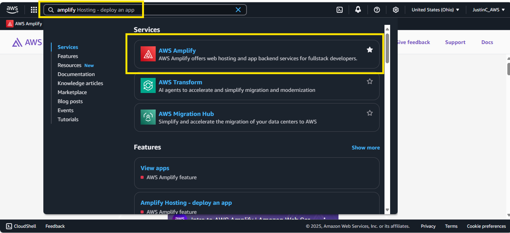
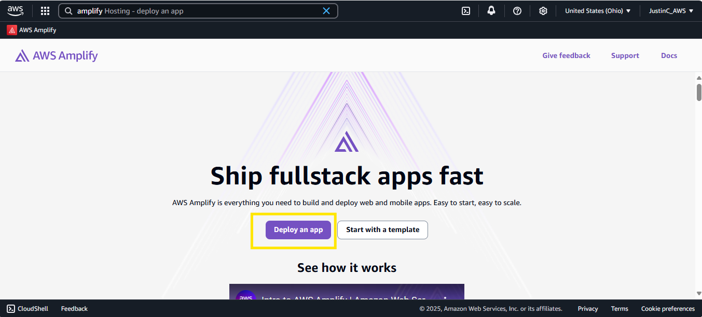
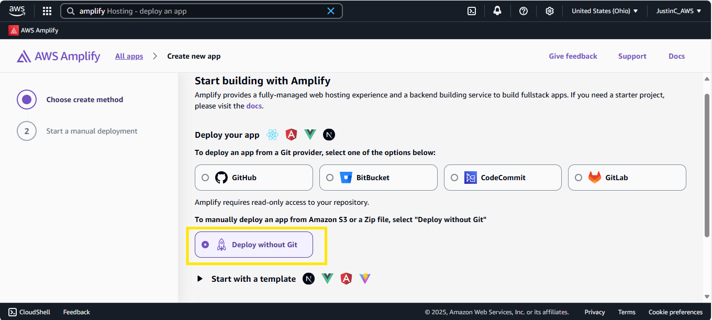
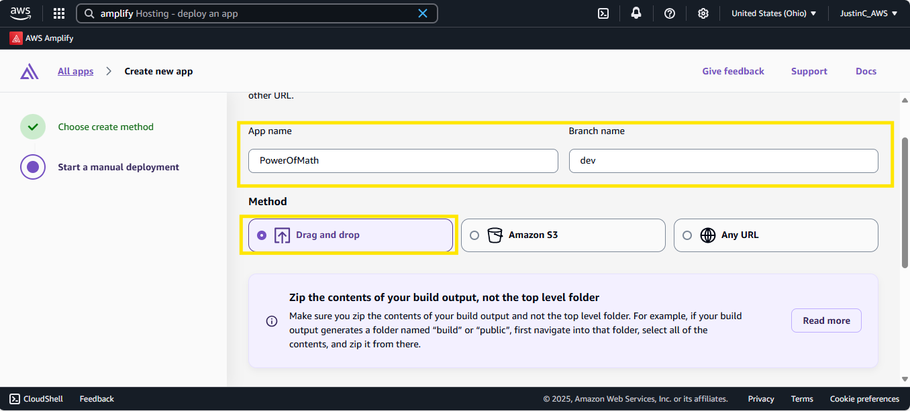
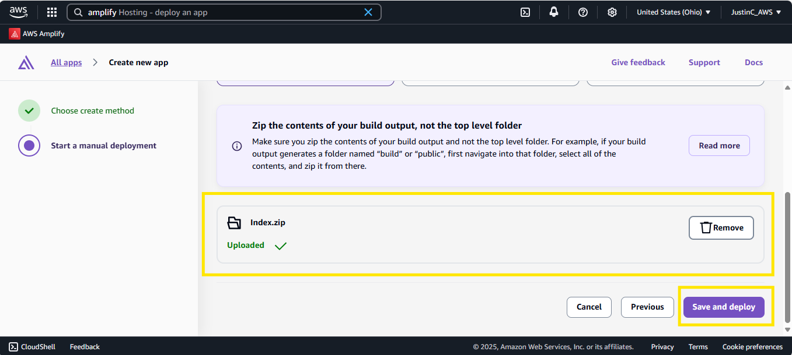

.png)

# To The Power of Math! Application - AWS Project

[Click - AWS-Based Exponential Calculation Application](https://dev.dcszzvgx7dd82.amplifyapp.com/)

 <ins>Project Summary</ins> 

This application is built on Amazon Web Services (AWS) to perform mathematical calculations, specifically raising a base number to a given exponent. It utilizes a serverless architecture for scalability and efficiency, leveraging services such as AWS Lambda for backend computation, Amazon API Gateway for secure access, and AWS Amplify or S3 for front-end hosting.

 <ins>**Part 1. AWS Amplify** </ins>

 
Create and host a simple webpage using AWS Amplify for a simple index.html 

 

 Choose a create method.

 

 Choose the App Name, Branch Name, and choose the Drag and Drop method to add the simple index.html.zip file.

 

 Save and Deploy.

  

 <ins>**Part 2. words**</ins> 

In order to create the Honey Pot, the Security Group rule, which only allows Inbound RDP traffic, was deleted, and a rule was created in the Network Security Group for the virtual machine (VM) that allows ALL traffic inbound. 

  

  

Using the newly created VM's Public IP address, and Remote Desktop Protocol (RDP), the VM was logged into in order to turn off the Windows firewall. 

 

 

 

 <ins>**Part 3. words**</ins> 

Within the VM, reviewed the Event Viewer and inspected the Security Logs to confirm that there is incoming log traffic such as event ID: 4625 for failed logins. 

  

 <ins>**Part 4. words**</ins> 

Created the Log Analytics Workspace (LAW). The LAW is the central hub for collecting, storing, and analyzing log data across Azure and even non-Azure environments. Think of it as a specialized data lake for operational insights. 

  

Created a Sentinel Instance and connected it to the LAW. Sentinel is a deployment of Microsoft’s cloud-native SIEM (Security Information and Event Management) and SOAR (Security Orchestration, Automation, and Response) solution within your Azure environment. 

  

Configured the "Windows Security Events via AMA" connector. This is a data ingestion tool in Microsoft Sentinel that uses the Azure Monitor Agent (AMA) to collect Windows security logs from machines and send them to a Log Analytics Workspace. 

  

  

 <ins>**Part 5. words**</ins> 

Created the Data Collection Rule (DCR) within Sentinel, and created a Watchlist. A DCR stands for Data Collection Rule—it’s a configuration that tells Azure Monitor what data to collect, how to process it, and where to send it. A watchlist is a customizable list of data that helps you correlate, filter, and enrich security events. Think of it as a reference table you can use to enhance threat detection and response. 

 Imported a spreadsheet (as a “Sentinel Watchlist”) which contains geographic information for each block of IP addresses. 

  

  

 <ins>**Part 6. words**</ins> 

  

 As a project overview, a honeypot environment was established within Microsoft Azure by provisioning a virtual machine (VM) intentionally exposed to the public internet. Steps involve: Honeypot Configuration, Log Collection and Forwarding, SIEM Integration, and Attack Source Visualization. Below is a visual representation of what was created. 

  

