.png)

# To The Power of Math! Application - AWS Project

[Click - AWS-Based Exponential Calculation Application](https://dev.dcszzvgx7dd82.amplifyapp.com/)

 <ins>Project Summary</ins> 

This application is built on Amazon Web Services (AWS) to perform mathematical calculations, specifically raising a base number to a given exponent. It utilizes a serverless architecture for scalability and efficiency, leveraging services such as AWS Lambda for backend computation, Amazon API Gateway for secure access, and AWS Amplify or S3 for front-end hosting.

 <ins>**Part 1. AWS Amplify** </ins> 

 Create and host a simple webpage using AWS Amplify for a simple index.html  

 

 Choose a create method.

 

 Choose the App Name, Branch Name, and choose the Drag and Drop method to add the simple index.html.zip file.

 

 Save and Deploy.

  

  <ins>**Part 2. AWS Lambda**</ins> 

 Use AWS Lambda to add the mathematical function to be triggered with Python code. 
Choose the "Author from Scratch" option to create the function, add the Function Name, and choose the Runtime (language for the function). 

 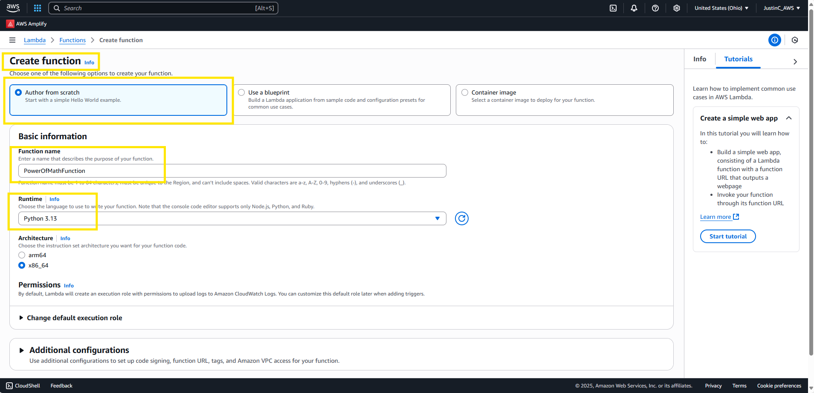 

 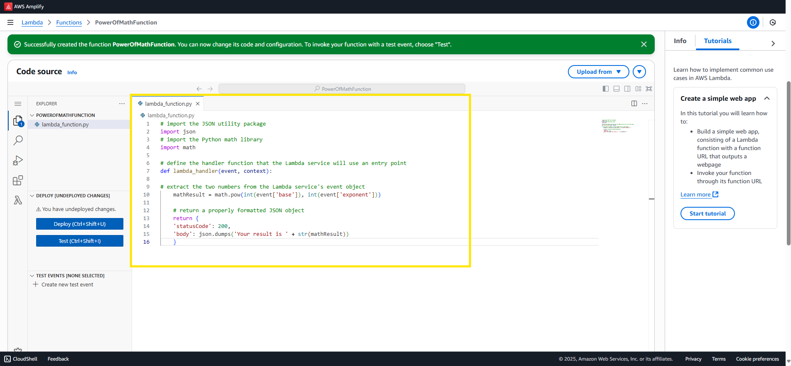 

 Test the Lambda function. 

 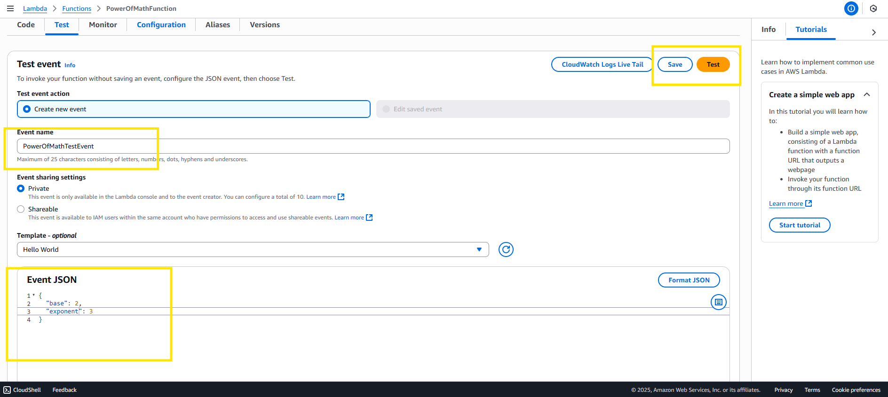

 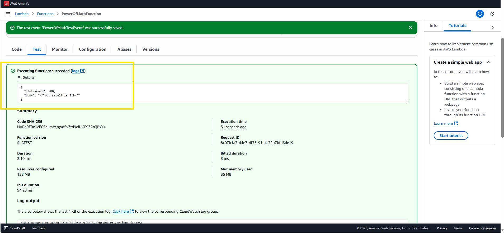 

 Configure the Role Name and Permissions. 

 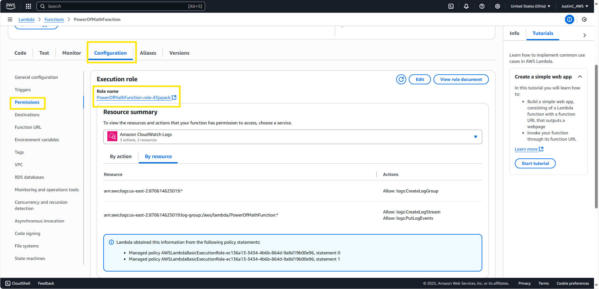 
 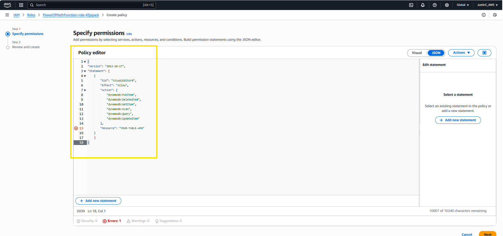 
 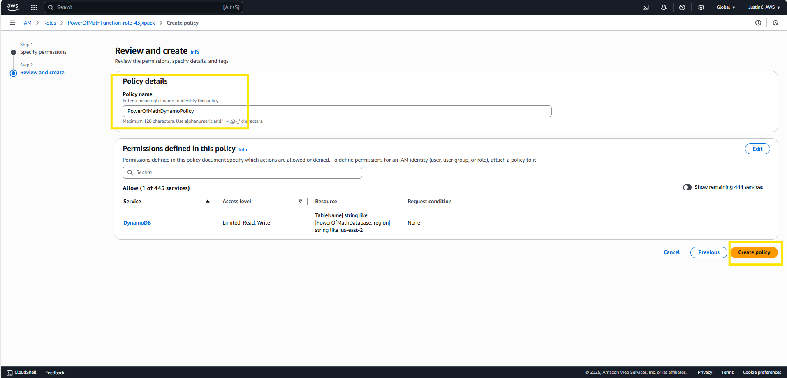 

  <ins>**Part 3. AWS API Gateway**</ins> 

 Use AWS API Gateway to invoke the AWS Lambda function and enable CORS to allow objects in different domains to speak to each other. 

 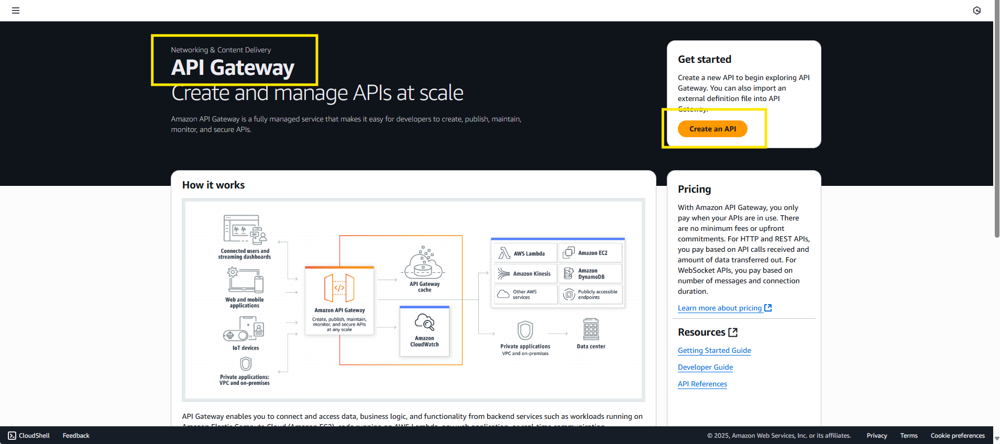 
 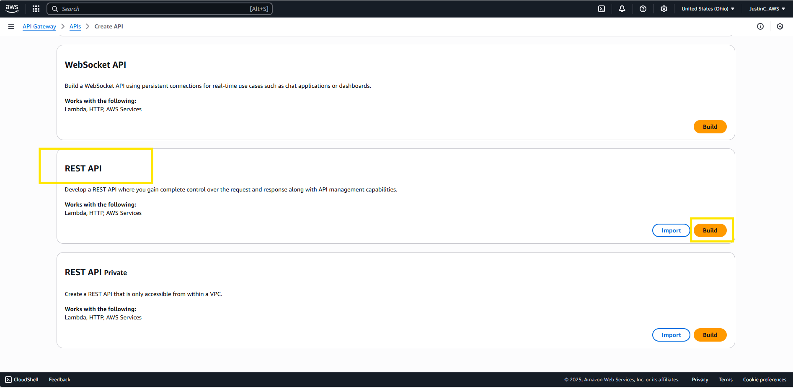 
 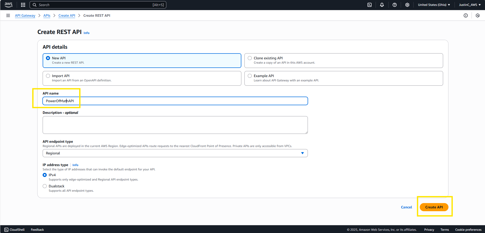 
 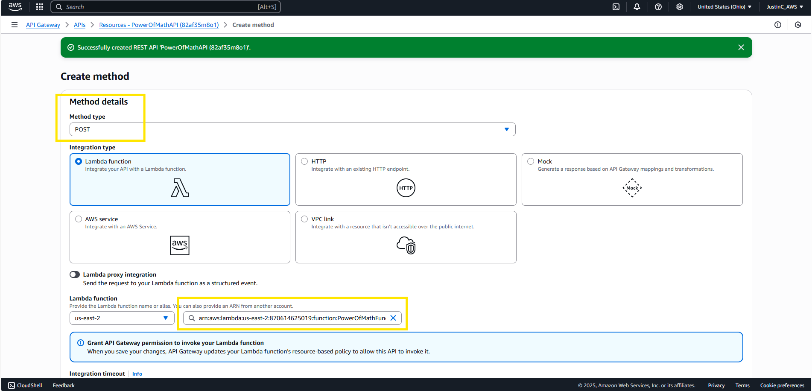 
 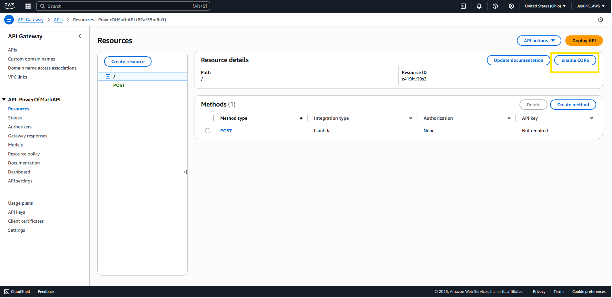 
 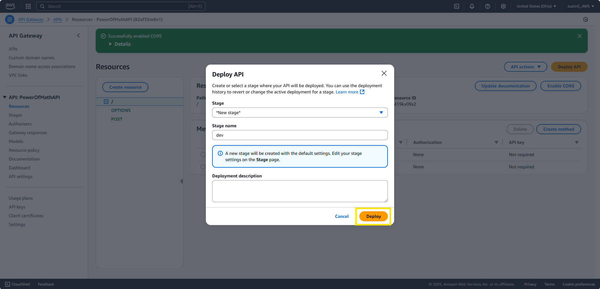 

  <ins>**Part 4. AWS DynamoDB**</ins> 

 Use AWS DynamoDB to store results. Since AWS DynamoDB is noSQL, its lighter and easier to use. 

 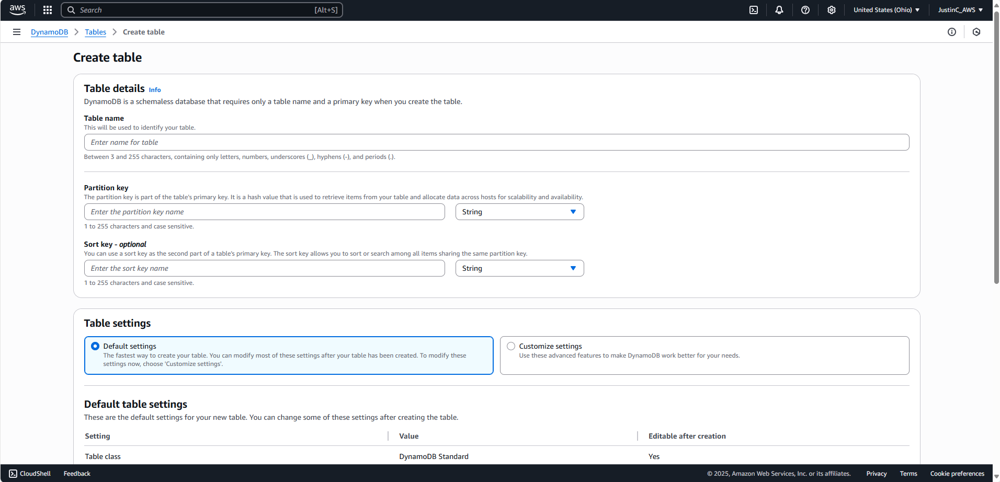 
 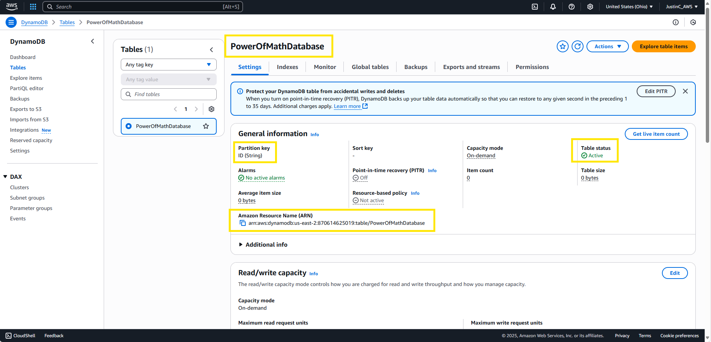 

 Use AWS IAM (Identity and Access Management) to grant the AWS Lambda function the permission to add results to the AWS DynamoDB with the ARN URL. 
 Finally, Update the AWS Amplify code with the API Gateway URL to fully connect all the components for the application.

